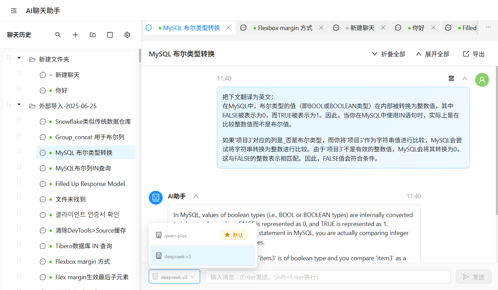
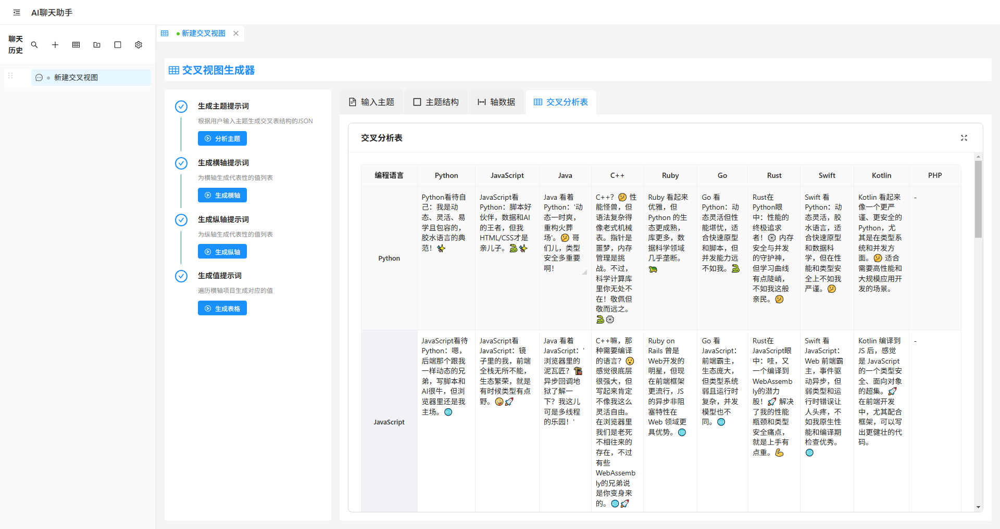
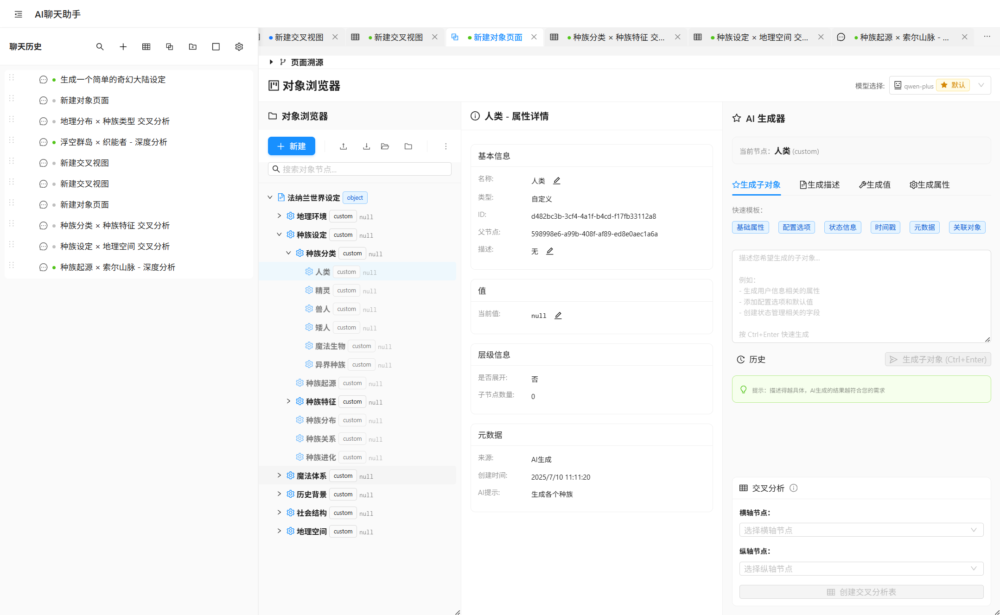

# Pointer AI Chat Assistant


[中文版](README.zh-CN.md) | **English**

An AI chat application built with Electron + React + TypeScript, supporting **multi-model conversations**, **intelligent crosstab data analysis**, and **knowledge organization management**.

基于 Electron + React + TypeScript 开发的AI聊天应用，支持**多模型对话**、**交叉数据分析**和**知识组织管理**。[查看中文 README 介绍](README.zh-CN.md) 

## Key Features

### AI Conversation System

- Support for multiple AI models (OpenAI GPT, Claude, DeepSeek, etc.)
- Streaming conversation responses with reasoning process display
- Message tree branch management with conversation version control
- Hierarchical chat history organization with parallel tab workflow
- Global content search with keyword highlighting
- Global AI generation task management with task monitoring and cancellation
- Global Q&A traceability mechanism to track generation relationships across pages

### Unique Features

- **AI Crosstab Analysis**: Automatically generate structured comparison analysis tables
- **AI Object Manager**: Visual knowledge data structure management
- **Data Import/Export**: Support for mainstream AI platform data migration (OpenAI ChatGPT / Deepseek Chat)

### Knowledge Management

- Folder hierarchical organization
- Message bookmarking and tagging
- Batch operations and drag-and-drop sorting
- Data backup and recovery

#### Main Interface



#### Crosstab Analysis



#### Object Manager



## Quick Start

### Requirements

- Node.js 18+
- Windows 10+, macOS 10.15+, or Linux

### Installation & Setup

```bash
# Install dependencies
pnpm install

# Development mode
pnpm dev

# Build application
pnpm build:win    # Windows
pnpm build:mac    # macOS
pnpm build:linux  # Linux
```

### Basic Configuration

1. Launch the application and go to settings
2. Configure AI model parameters:
   - Configuration name
   - API endpoint
   - Access key
   - Model identifier
3. Select default model and test connection

## Core Features

### Crosstab Analysis

Convert any topic into structured comparison analysis tables, suitable for:

- Academic research literature comparison
- Business decision solution evaluation
- Educational material knowledge organization
- Product feature competitive analysis

Workflow:

1. Input analysis topic
2. AI automatically generates table structure
3. Fill intersection data
4. Manual editing and optimization

### Object Browser

Visualize complex data structures with support for:

- Tree structure display
- AI automatic node generation
- Manual editing and organization
- Structured data export

### Chat Branch Management

- Message tree structure
- Independent conversations between branches
- Historical version switching
- Context inheritance

## Technical Architecture

### Core Technologies

- **Frontend**: React 19 + TypeScript + Ant Design
- **Backend**: Electron main process
- **Build**: Vite + Electron Builder
- **Styling**: CSS Modules + SCSS

### Project Structure

```
src/
├── main/          # Electron main process
├── renderer/      # Renderer process
│   ├── components/  # React components
│   ├── store/      # State management
│   ├── services/   # Business logic
│   └── utils/      # Utility functions
└── preload/       # Preload scripts
```

### Key Dependencies

- `react-markdown`: Markdown rendering
- `mermaid`: Chart drawing
- `katex`: Mathematical formulas
- `html2canvas`: Screenshot functionality
- `rehype-highlight`: Code highlighting

## Use Cases

**Education & Research**: Course design, knowledge organization, literature analysis  
**Business Analysis**: Market research, competitive comparison, strategic planning  
**Content Creation**: Topic planning, material organization, structured writing  
**Personal Learning**: Note organization, knowledge comparison, review materials

## Development & Contribution

### Development Workflow

1. Fork the project and create a feature branch
2. Follow TypeScript and ESLint standards
3. Submit code and create Pull Request

### Code Standards

- Use functional components and Hooks
- Follow conventional commits format
- Maintain type safety

### Key Improvement Areas

- Bug fixes
- Generation prompt and context optimization
- Performance optimization and user experience improvement

## License

MIT License - See [LICENSE](LICENSE) file for details 